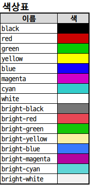

# Colortext

`colortext`를 사용하면 python shell 또는 Notebook output cell에 색이 들어간 문자열을 출력할 수 있습니다.

## Installation

```shell
pip install git+https://github.com/gbhwang/colortext.git
```

## Usage

```python
from colortext import colored

print(colored("Text Color", "red"))
print(bcolored("Background Text Color", "yellow"))
```

## Color

글자색, 배경색 총 16가지 색상을 지원합니다.  


